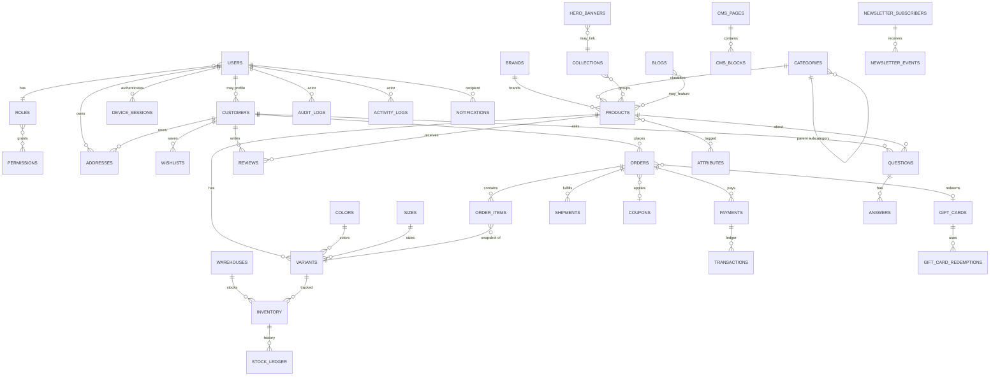

# 02 — Database Design

> MongoDB schema **planning only**. No Mongoose models in this phase.  
> Conventions apply to every business collection unless noted.

---

## 1. Global Conventions

| Convention       | Rule                                                                               |
| ---------------- | ---------------------------------------------------------------------------------- |
| `_id`            | ObjectId (default)                                                                 |
| Timestamps       | `createdAt`, `updatedAt` (UTC ISODate)                                             |
| Soft delete      | `isDeleted: boolean`, `deletedAt: Date \| null`                                    |
| Status           | Enum string fields; never magic numbers                                            |
| Money            | Integer **minor units** (e.g. cents/cents of LKR) + `currency` ISO 4217            |
| Refs             | Store `ObjectId` + denormalized snapshot where historical accuracy needed (orders) |
| Tenancy (future) | Reserve `tenantId` optional field — unused in v1 single-tenant                     |
| Versioning       | `version: number` on inventory & order aggregates for optimistic concurrency       |

### Common Index Patterns

- `{ isDeleted: 1, status: 1 }` on list endpoints
- Unique sparse indexes for optional unique fields (`email`, `sku`, `slug`)
- TTL indexes on OTPs, ephemeral reservations, raw analytics if retention capped

---

## 2. Entity Relationship Diagram (Mermaid)



---

## 3. Identity Collections

### 3.1 `users`

**Purpose:** Authentication identity for staff and customers.

| Field                 | Type           | Notes                                                         |
| --------------------- | -------------- | ------------------------------------------------------------- |
| email                 | string         | lowercased                                                    |
| passwordHash          | string         | argon2/bcrypt                                                 |
| firstName             | string         |                                                               |
| lastName              | string         |                                                               |
| phone                 | string \| null | E.164                                                         |
| roleId                | ObjectId       | → `roles`                                                     |
| status                | string         | `active` \| `invited` \| `locked` \| `suspended` \| `deleted` |
| emailVerifiedAt       | Date \| null   |                                                               |
| phoneVerifiedAt       | Date \| null   |                                                               |
| lastLoginAt           | Date \| null   |                                                               |
| failedLoginAttempts   | number         |                                                               |
| lockedUntil           | Date \| null   |                                                               |
| passwordChangedAt     | Date \| null   |                                                               |
| mfaEnabled            | boolean        |                                                               |
| metadata              | object         | optional                                                      |
| isDeleted             | boolean        |                                                               |
| deletedAt             | Date \| null   |                                                               |
| createdAt / updatedAt | Date           |                                                               |

**Indexes:** unique `{ email: 1 }`; `{ roleId: 1 }`; `{ status: 1, isDeleted: 1 }`  
**Soft delete:** yes

**Example:**

```json
{
  "_id": "665f…",
  "email": "admin@feplatform.com",
  "passwordHash": "$2a$12$…",
  "firstName": "Asha",
  "lastName": "Perera",
  "phone": "+94771234567",
  "roleId": "665a…",
  "status": "active",
  "emailVerifiedAt": "2026-01-10T10:00:00.000Z",
  "failedLoginAttempts": 0,
  "lockedUntil": null,
  "mfaEnabled": false,
  "isDeleted": false,
  "deletedAt": null,
  "createdAt": "2026-01-01T00:00:00.000Z",
  "updatedAt": "2026-01-10T10:00:00.000Z"
}
```

---

### 3.2 `roles`

| Field                 | Type       | Notes                       |
| --------------------- | ---------- | --------------------------- |
| key                   | string     | `super_admin`, `admin`, …   |
| name                  | string     | Display                     |
| description           | string     |                             |
| permissionIds         | ObjectId[] | → `permissions`             |
| isSystem              | boolean    | Prevent delete of built-ins |
| status                | string     | `active` \| `inactive`      |
| isDeleted             | boolean    |                             |
| createdAt / updatedAt | Date       |                             |

**Indexes:** unique `{ key: 1 }`  
**Validation:** `key` slug `^[a-z0-9_]+$`

---

### 3.3 `permissions`

| Field                 | Type    | Notes             |
| --------------------- | ------- | ----------------- |
| key                   | string  | `products.create` |
| module                | string  | `products`        |
| action                | string  | `create`          |
| description           | string  |                   |
| isSystem              | boolean |                   |
| createdAt / updatedAt | Date    |                   |

**Indexes:** unique `{ key: 1 }`; `{ module: 1 }`  
**Soft delete:** no (deactivate via removal from roles)

---

### 3.4 `device_sessions`

**Purpose:** Refresh-token sessions / device tracking.

| Field                 | Type           | Notes           |
| --------------------- | -------------- | --------------- |
| userId                | ObjectId       | → `users`       |
| refreshTokenHash      | string         | store hash only |
| familyId              | string         | rotation family |
| userAgent             | string         |                 |
| ip                    | string         |                 |
| deviceLabel           | string \| null |                 |
| expiresAt             | Date           |                 |
| revokedAt             | Date \| null   |                 |
| lastUsedAt            | Date           |                 |
| createdAt / updatedAt | Date           |                 |

**Indexes:** `{ userId: 1, revokedAt: 1 }`; unique `{ refreshTokenHash: 1 }`; TTL optional on `expiresAt`  
**Soft delete:** revoke via `revokedAt`

---

### 3.5 `otp_challenges`

| Field       | Type             | Notes                                         |
| ----------- | ---------------- | --------------------------------------------- |
| userId      | ObjectId \| null |                                               |
| channel     | string           | `email` \| `sms`                              |
| destination | string           |                                               |
| purpose     | string           | `login` \| `verify_email` \| `reset_password` |
| codeHash    | string           |                                               |
| attempts    | number           |                                               |
| expiresAt   | Date             |                                               |
| consumedAt  | Date \| null     |                                               |
| createdAt   | Date             |                                               |

**Indexes:** `{ destination: 1, purpose: 1 }`; TTL `{ expiresAt: 1 }`

---

## 4. Customer & CRM

### 4.1 `customers`

| Field                    | Type             | Notes                                           |
| ------------------------ | ---------------- | ----------------------------------------------- |
| userId                   | ObjectId \| null | → `users` (null for legacy/guest merge pending) |
| email                    | string           |                                                 |
| phone                    | string \| null   |                                                 |
| firstName / lastName     | string           |                                                 |
| dateOfBirth              | Date \| null     |                                                 |
| gender                   | string \| null   |                                                 |
| defaultShippingAddressId | ObjectId \| null |                                                 |
| defaultBillingAddressId  | ObjectId \| null |                                                 |
| marketingOptIn           | boolean          |                                                 |
| status                   | string           | `active` \| `blocked`                           |
| lifetimeValue            | number           | minor units denorm                              |
| orderCount               | number           | denorm                                          |
| isDeleted                | boolean          |                                                 |
| createdAt / updatedAt    | Date             |                                                 |

**Indexes:** unique sparse `{ userId: 1 }`; unique `{ email: 1 }`; `{ phone: 1 }` sparse

---

### 4.2 `addresses`

| Field                 | Type           | Notes                |
| --------------------- | -------------- | -------------------- |
| ownerType             | string         | `customer` \| `user` |
| ownerId               | ObjectId       |                      |
| label                 | string         | Home / Work          |
| fullName              | string         |                      |
| phone                 | string         |                      |
| line1 / line2         | string         |                      |
| city                  | string         |                      |
| state                 | string \| null |                      |
| postalCode            | string         |                      |
| country               | string         | ISO 3166-1 alpha-2   |
| isDefaultShipping     | boolean        |                      |
| isDefaultBilling      | boolean        |                      |
| isDeleted             | boolean        |                      |
| createdAt / updatedAt | Date           |                      |

**Indexes:** `{ ownerType: 1, ownerId: 1, isDeleted: 1 }`

---

### 4.3 `wishlists`

| Field                 | Type     | Notes  |
| --------------------- | -------- | ------ |
| customerId            | ObjectId |        |
| variantId             | ObjectId |        |
| productId             | ObjectId | denorm |
| addedAt               | Date     |        |
| createdAt / updatedAt | Date     |        |

**Indexes:** unique `{ customerId: 1, variantId: 1 }`

---

### 4.4 `contact_messages`

| Field                 | Type             | Notes                                          |
| --------------------- | ---------------- | ---------------------------------------------- |
| name                  | string           |                                                |
| email                 | string           |                                                |
| phone                 | string \| null   |                                                |
| subject               | string           |                                                |
| message               | string           |                                                |
| status                | string           | `new` \| `in_progress` \| `resolved` \| `spam` |
| assignedToUserId      | ObjectId \| null |                                                |
| ip                    | string \| null   |                                                |
| isDeleted             | boolean          |                                                |
| createdAt / updatedAt | Date             |                                                |

---

### 4.5 `newsletter_subscribers`

| Field                 | Type         | Notes                                       |
| --------------------- | ------------ | ------------------------------------------- |
| email                 | string       |                                             |
| status                | string       | `subscribed` \| `unsubscribed` \| `bounced` |
| source                | string       | footer / checkout / popup                   |
| subscribedAt          | Date         |                                             |
| unsubscribedAt        | Date \| null |                                             |
| createdAt / updatedAt | Date         |                                             |

**Indexes:** unique `{ email: 1 }`

---

## 5. Catalog

### 5.1 `categories`

**Purpose:** Categories **and** subcategories via self-reference.

| Field                 | Type             | Notes                             |
| --------------------- | ---------------- | --------------------------------- |
| name                  | string           |                                   |
| slug                  | string           |                                   |
| parentId              | ObjectId \| null | null = root category              |
| path                  | string           | materialized `/women/dresses`     |
| depth                 | number           | 0-based                           |
| description           | string \| null   |                                   |
| image                 | object \| null   | `{ url, alt, key }`               |
| sortOrder             | number           |                                   |
| seo                   | object           | title, description, keywords[]    |
| status                | string           | `active` \| `draft` \| `archived` |
| isDeleted             | boolean          |                                   |
| createdAt / updatedAt | Date             |                                   |

**Indexes:** unique `{ slug: 1 }`; `{ parentId: 1, sortOrder: 1 }`; `{ path: 1 }`  
**Validation:** max depth (e.g. 3); slug unique globally

---

### 5.2 `brands`

| Field                 | Type           | Notes                  |
| --------------------- | -------------- | ---------------------- |
| name                  | string         |                        |
| slug                  | string         |                        |
| description           | string \| null |                        |
| logo                  | object \| null |                        |
| website               | string \| null |                        |
| status                | string         | `active` \| `inactive` |
| seo                   | object         |                        |
| isDeleted             | boolean        |                        |
| createdAt / updatedAt | Date           |                        |

**Indexes:** unique `{ slug: 1 }`; unique `{ name: 1 }`

---

### 5.3 `collections`

| Field                 | Type           | Notes                              |
| --------------------- | -------------- | ---------------------------------- |
| name                  | string         |                                    |
| slug                  | string         |                                    |
| description           | string \| null |                                    |
| type                  | string         | `manual` \| `automated` (future)   |
| productIds            | ObjectId[]     | for manual                         |
| rules                 | object \| null | future automated                   |
| heroImage             | object \| null |                                    |
| status                | string         | `active` \| `draft` \| `scheduled` |
| startsAt / endsAt     | Date \| null   |                                    |
| seo                   | object         |                                    |
| isDeleted             | boolean        |                                    |
| createdAt / updatedAt | Date           |                                    |

**Indexes:** unique `{ slug: 1 }`; `{ status: 1, startsAt: 1, endsAt: 1 }`

---

### 5.4 `colors`

| Field                 | Type           | Notes                  |
| --------------------- | -------------- | ---------------------- |
| name                  | string         |                        |
| code                  | string         | `BLK`, `NVY`           |
| hex                   | string         | `#000000`              |
| swatchImage           | object \| null |                        |
| status                | string         | `active` \| `inactive` |
| isDeleted             | boolean        |                        |
| createdAt / updatedAt | Date           |                        |

**Indexes:** unique `{ code: 1 }`

---

### 5.5 `sizes`

| Field                 | Type           | Notes                 |
| --------------------- | -------------- | --------------------- |
| name                  | string         | `M`, `32`, `UK 8`     |
| code                  | string         |                       |
| chart                 | string \| null | e.g. `alpha`, `waist` |
| sortOrder             | number         |                       |
| status                | string         |                       |
| isDeleted             | boolean        |                       |
| createdAt / updatedAt | Date           |                       |

**Indexes:** unique `{ code: 1 }`

---

### 5.6 `attributes`

| Field                 | Type           | Notes                                       |
| --------------------- | -------------- | ------------------------------------------- |
| name                  | string         | Material                                    |
| code                  | string         | `material`                                  |
| type                  | string         | `text` \| `number` \| `select` \| `boolean` |
| options               | string[]       | for select                                  |
| unit                  | string \| null |                                             |
| isFilterable          | boolean        |                                             |
| isVariantDefining     | boolean        | usually false (color/size separate)         |
| status                | string         |                                             |
| isDeleted             | boolean        |                                             |
| createdAt / updatedAt | Date           |                                             |

**Indexes:** unique `{ code: 1 }`

---

### 5.7 `products`

| Field                     | Type             | Notes                                               |
| ------------------------- | ---------------- | --------------------------------------------------- |
| name                      | string           |                                                     |
| slug                      | string           |                                                     |
| description               | string           | HTML/MD sanitized                                   |
| shortDescription          | string \| null   |                                                     |
| brandId                   | ObjectId \| null |                                                     |
| categoryIds               | ObjectId[]       | primary + secondary                                 |
| primaryCategoryId         | ObjectId         |                                                     |
| collectionIds             | ObjectId[]       |                                                     |
| tagIds / tags             | string[]         | simple tags v1                                      |
| attributes                | array            | `{ attributeId, code, value }`                      |
| images                    | array            | `{ url, key, alt, sortOrder, isPrimary }`           |
| status                    | string           | `draft` \| `active` \| `archived` \| `out_of_stock` |
| visibility                | string           | `public` \| `hidden` \| `catalog_only`              |
| basePrice                 | number           | display fallback minor units                        |
| compareAtPrice            | number \| null   |                                                     |
| costPrice                 | number \| null   | admin only                                          |
| currency                  | string           |                                                     |
| taxClass                  | string \| null   |                                                     |
| weightGrams               | number \| null   | default                                             |
| supplierId / supplierName | string \| null   |                                                     |
| seo                       | object           | title, description, canonical                       |
| isFeatured                | boolean          |                                                     |
| publishedAt               | Date \| null     |                                                     |
| version                   | number           |                                                     |
| isDeleted                 | boolean          |                                                     |
| createdAt / updatedAt     | Date             |                                                     |

**Indexes:**

- unique `{ slug: 1 }`
- `{ status: 1, isDeleted: 1, publishedAt: -1 }`
- `{ brandId: 1 }`
- `{ categoryIds: 1 }`
- `{ collectionIds: 1 }`
- text index on `name`, `shortDescription`, `tags`

**Example:**

```json
{
  "_id": "66p…",
  "name": "Linen Blend Summer Shirt",
  "slug": "linen-blend-summer-shirt",
  "brandId": "66b…",
  "primaryCategoryId": "66c…",
  "categoryIds": ["66c…", "66c2…"],
  "collectionIds": ["66col…"],
  "tags": ["summer", "linen", "casual"],
  "attributes": [{ "attributeId": "66a…", "code": "material", "value": "Linen Blend" }],
  "images": [
    {
      "url": "https://cdn…/1.webp",
      "key": "products/…",
      "alt": "Front",
      "sortOrder": 0,
      "isPrimary": true
    }
  ],
  "status": "active",
  "visibility": "public",
  "basePrice": 599000,
  "compareAtPrice": 799000,
  "costPrice": 250000,
  "currency": "LKR",
  "weightGrams": 280,
  "supplierName": "Colombo Textiles Ltd",
  "seo": { "title": "Linen Blend Summer Shirt", "description": "…" },
  "isFeatured": true,
  "publishedAt": "2026-03-01T00:00:00.000Z",
  "version": 3,
  "isDeleted": false,
  "createdAt": "2026-02-01T00:00:00.000Z",
  "updatedAt": "2026-03-01T00:00:00.000Z"
}
```

---

### 5.8 `variants`

| Field                 | Type             | Notes                   |
| --------------------- | ---------------- | ----------------------- |
| productId             | ObjectId         |                         |
| sku                   | string           | unique                  |
| barcode               | string \| null   |                         |
| title                 | string           | `Black / M`             |
| colorId               | ObjectId \| null |                         |
| sizeId                | ObjectId \| null |                         |
| optionValues          | object           | extensible              |
| images                | array            | override product images |
| price                 | number           | sell price minor        |
| salePrice             | number \| null   |                         |
| costPrice             | number \| null   |                         |
| currency              | string           |                         |
| weightGrams           | number \| null   |                         |
| isDefault             | boolean          |                         |
| status                | string           | `active` \| `inactive`  |
| isDeleted             | boolean          |                         |
| createdAt / updatedAt | Date             |                         |

**Indexes:** unique `{ sku: 1 }`; unique sparse `{ barcode: 1 }`; `{ productId: 1, colorId: 1, sizeId: 1 }` unique compound sparse-aware

**Stock:** **not** stored here — see `inventory`.

---

## 6. Inventory

### 6.1 `warehouses`

| Field                 | Type    | Notes                  |
| --------------------- | ------- | ---------------------- |
| code                  | string  | `CMB-01`               |
| name                  | string  |                        |
| address               | object  | embedded address       |
| isDefault             | boolean |                        |
| status                | string  | `active` \| `inactive` |
| isDeleted             | boolean |                        |
| createdAt / updatedAt | Date    |                        |

**Indexes:** unique `{ code: 1 }`

---

### 6.2 `inventory`

**Purpose:** Stock position per variant × warehouse.

| Field                 | Type     | Notes                                                           |
| --------------------- | -------- | --------------------------------------------------------------- |
| warehouseId           | ObjectId |                                                                 |
| variantId             | ObjectId |                                                                 |
| productId             | ObjectId | denorm                                                          |
| onHand                | number   | physical count                                                  |
| reserved              | number   | held for unpaid/paid-not-shipped                                |
| incoming              | number   | PO inbound                                                      |
| damaged               | number   | quarantined                                                     |
| available             | number   | denorm: `onHand - reserved - damaged` (also compute in service) |
| reorderPoint          | number   | low stock threshold                                             |
| version               | number   | optimistic lock                                                 |
| updatedAt / createdAt | Date     |                                                                 |

**Indexes:** unique `{ warehouseId: 1, variantId: 1 }`; `{ available: 1 }`; `{ variantId: 1 }`  
**Validation:** all stock ints ≥ 0; `reserved ≤ onHand`

---

### 6.3 `stock_ledger`

**Purpose:** Immutable movement history.

| Field         | Type             | Notes                                                                                             |
| ------------- | ---------------- | ------------------------------------------------------------------------------------------------- |
| warehouseId   | ObjectId         |                                                                                                   |
| variantId     | ObjectId         |                                                                                                   |
| type          | string           | `inbound` \| `outbound` \| `reserve` \| `release` \| `commit` \| `adjust` \| `damage` \| `return` |
| quantity      | number           | signed or absolute + direction                                                                    |
| balanceAfter  | object           | snapshot `{ onHand, reserved, available }`                                                        |
| referenceType | string           | `order` \| `po` \| `manual`                                                                       |
| referenceId   | ObjectId \| null |                                                                                                   |
| note          | string \| null   |                                                                                                   |
| createdBy     | ObjectId \| null |                                                                                                   |
| createdAt     | Date             |                                                                                                   |

**Indexes:** `{ variantId: 1, createdAt: -1 }`; `{ referenceType: 1, referenceId: 1 }`  
**Soft delete:** **never** (append-only)

---

### 6.4 `inventory_reservations`

| Field                 | Type     | Notes                                              |
| --------------------- | -------- | -------------------------------------------------- |
| orderId               | ObjectId |                                                    |
| variantId             | ObjectId |                                                    |
| warehouseId           | ObjectId |                                                    |
| quantity              | number   |                                                    |
| status                | string   | `active` \| `committed` \| `released` \| `expired` |
| expiresAt             | Date     | unpaid TTL                                         |
| createdAt / updatedAt | Date     |                                                    |

**Indexes:** `{ status: 1, expiresAt: 1 }`; `{ orderId: 1 }`

---

## 7. Commerce — Orders

### 7.1 `orders`

| Field                 | Type             | Notes                                                                                 |
| --------------------- | ---------------- | ------------------------------------------------------------------------------------- |
| orderNumber           | string           | human `FE-2026-000123`                                                                |
| customerId            | ObjectId \| null | guest nullable                                                                        |
| userId                | ObjectId \| null |                                                                                       |
| email                 | string           | snapshot                                                                              |
| status                | string           | see order-flow doc                                                                    |
| paymentStatus         | string           | `pending` \| `authorized` \| `paid` \| `failed` \| `refunded` \| `partially_refunded` |
| fulfillmentStatus     | string           | `unfulfilled` \| `partial` \| `fulfilled`                                             |
| currency              | string           |                                                                                       |
| itemsSubtotal         | number           |                                                                                       |
| discountTotal         | number           |                                                                                       |
| shippingTotal         | number           |                                                                                       |
| taxTotal              | number           |                                                                                       |
| giftCardTotal         | number           |                                                                                       |
| grandTotal            | number           |                                                                                       |
| couponId              | ObjectId \| null |                                                                                       |
| couponCode            | string \| null   | snapshot                                                                              |
| shippingAddress       | object           | snapshot                                                                              |
| billingAddress        | object           | snapshot                                                                              |
| notes                 | string \| null   |                                                                                       |
| cancelReason          | string \| null   |                                                                                       |
| statusHistory         | array            | `{ status, at, by, note }`                                                            |
| placedAt              | Date \| null     |                                                                                       |
| paidAt                | Date \| null     |                                                                                       |
| cancelledAt           | Date \| null     |                                                                                       |
| version               | number           |                                                                                       |
| isDeleted             | boolean          |                                                                                       |
| createdAt / updatedAt | Date             |                                                                                       |

**Indexes:** unique `{ orderNumber: 1 }`; `{ customerId: 1, createdAt: -1 }`; `{ status: 1, createdAt: -1 }`; `{ paymentStatus: 1 }`

---

### 7.2 `order_items`

| Field                 | Type             | Notes               |
| --------------------- | ---------------- | ------------------- |
| orderId               | ObjectId         |                     |
| productId             | ObjectId         |                     |
| variantId             | ObjectId         |                     |
| sku                   | string           | snapshot            |
| name                  | string           | snapshot            |
| attributes            | object           | color/size snapshot |
| image                 | string \| null   | snapshot URL        |
| unitPrice             | number           |                     |
| quantity              | number           |                     |
| discount              | number           |                     |
| tax                   | number           |                     |
| lineTotal             | number           |                     |
| warehouseId           | ObjectId \| null | allocated           |
| createdAt / updatedAt | Date             |                     |

**Indexes:** `{ orderId: 1 }`; `{ variantId: 1 }`

---

## 8. Payments & Gift Cards

### 8.1 `payments`

| Field                 | Type           | Notes                                                                                                  |
| --------------------- | -------------- | ------------------------------------------------------------------------------------------------------ |
| orderId               | ObjectId       |                                                                                                        |
| method                | string         | `payhere` \| `koko` \| `mintpay` \| `cod`                                                              |
| status                | string         | `pending` \| `processing` \| `requires_action` \| `succeeded` \| `failed` \| `cancelled` \| `refunded` |
| amount                | number         |                                                                                                        |
| currency              | string         |                                                                                                        |
| gatewayPaymentId      | string \| null |                                                                                                        |
| idempotencyKey        | string         |                                                                                                        |
| clientRedirectUrl     | string \| null |                                                                                                        |
| rawInitResponse       | object \| null | redacted                                                                                               |
| paidAt                | Date \| null   |                                                                                                        |
| failureCode           | string \| null |                                                                                                        |
| createdAt / updatedAt | Date           |                                                                                                        |

**Indexes:** unique `{ idempotencyKey: 1 }`; `{ orderId: 1 }`; `{ gatewayPaymentId: 1 }` sparse

---

### 8.2 `transactions`

| Field          | Type            | Notes                                                    |
| -------------- | --------------- | -------------------------------------------------------- |
| paymentId      | ObjectId        |                                                          |
| orderId        | ObjectId        |                                                          |
| type           | string          | `charge` \| `refund` \| `capture` \| `void` \| `webhook` |
| amount         | number          |                                                          |
| currency       | string          |                                                          |
| gateway        | string          |                                                          |
| gatewayTxnId   | string \| null  |                                                          |
| status         | string          | `success` \| `failed` \| `pending`                       |
| signatureValid | boolean \| null |                                                          |
| payloadHash    | string          | for idempotency                                          |
| rawPayload     | object          | encrypted/redacted at rest policy                        |
| processedAt    | Date            |                                                          |
| createdAt      | Date            |                                                          |

**Indexes:** unique `{ gateway: 1, gatewayTxnId: 1 }` sparse; `{ payloadHash: 1 }`; `{ paymentId: 1 }`  
**Soft delete:** never

---

### 8.3 `coupons`

| Field                 | Type           | Notes                                   |
| --------------------- | -------------- | --------------------------------------- |
| code                  | string         | uppercased                              |
| type                  | string         | `percent` \| `fixed` \| `free_shipping` |
| value                 | number         |                                         |
| minOrderAmount        | number \| null |                                         |
| maxDiscount           | number \| null |                                         |
| usageLimit            | number \| null |                                         |
| usageCount            | number         |                                         |
| perCustomerLimit      | number \| null |                                         |
| startsAt / endsAt     | Date \| null   |                                         |
| status                | string         | `active` \| `inactive` \| `expired`     |
| isDeleted             | boolean        |                                         |
| createdAt / updatedAt | Date           |                                         |

**Indexes:** unique `{ code: 1 }`

---

### 8.4 `gift_cards`

| Field                 | Type             | Notes                                             |
| --------------------- | ---------------- | ------------------------------------------------- |
| codeHash              | string           | never store raw code at rest after issue          |
| codeLast4             | string           | display                                           |
| initialBalance        | number           |                                                   |
| currentBalance        | number           |                                                   |
| currency              | string           |                                                   |
| status                | string           | `active` \| `redeemed` \| `expired` \| `disabled` |
| expiresAt             | Date \| null     |                                                   |
| issuedToCustomerId    | ObjectId \| null |                                                   |
| createdAt / updatedAt | Date             |                                                   |

**Indexes:** unique `{ codeHash: 1 }`

---

### 8.5 `gift_card_redemptions`

| Field      | Type     | Notes |
| ---------- | -------- | ----- |
| giftCardId | ObjectId |       |
| orderId    | ObjectId |       |
| amount     | number   |       |
| createdAt  | Date     |       |

---

## 9. Fulfillment

### 9.1 `shipments`

| Field                   | Type           | Notes                                                                                       |
| ----------------------- | -------------- | ------------------------------------------------------------------------------------------- |
| orderId                 | ObjectId       |                                                                                             |
| carrier                 | string \| null |                                                                                             |
| service                 | string \| null |                                                                                             |
| trackingNumber          | string \| null |                                                                                             |
| trackingUrl             | string \| null |                                                                                             |
| status                  | string         | `pending` \| `packed` \| `shipped` \| `in_transit` \| `delivered` \| `failed` \| `returned` |
| items                   | array          | `{ orderItemId, quantity }`                                                                 |
| shippedAt / deliveredAt | Date \| null   |                                                                                             |
| createdAt / updatedAt   | Date           |                                                                                             |

**Indexes:** `{ orderId: 1 }`; `{ trackingNumber: 1 }` sparse

---

## 10. Engagement & Content

### 10.1 `reviews`

| Field                 | Type             | Notes                                 |
| --------------------- | ---------------- | ------------------------------------- |
| productId             | ObjectId         |                                       |
| customerId            | ObjectId         |                                       |
| orderId               | ObjectId \| null | verified purchase                     |
| rating                | number           | 1–5                                   |
| title                 | string \| null   |                                       |
| body                  | string           |                                       |
| images                | array            |                                       |
| status                | string           | `pending` \| `approved` \| `rejected` |
| isDeleted             | boolean          |                                       |
| createdAt / updatedAt | Date             |                                       |

**Indexes:** `{ productId: 1, status: 1 }`; unique `{ productId: 1, customerId: 1, orderId: 1 }` sparse

---

### 10.2 `questions` / `answers`

**`questions`:** `productId`, `customerId`, `body`, `status` (`pending`\|`published`\|`hidden`), timestamps, soft delete

**`answers`:** `questionId`, `userId` (staff) or `customerId`, `body`, `isOfficial`, `status`, timestamps

**Indexes:** `{ productId: 1 }`; `{ questionId: 1 }`

---

### 10.3 `notifications`

| Field     | Type         | Notes                                  |
| --------- | ------------ | -------------------------------------- |
| userId    | ObjectId     |                                        |
| type      | string       |                                        |
| title     | string       |                                        |
| body      | string       |                                        |
| data      | object       | deep link payloads                     |
| channel   | string       | `in_app` \| `email` \| `sms` \| `push` |
| readAt    | Date \| null |                                        |
| createdAt | Date         |                                        |

**Indexes:** `{ userId: 1, readAt: 1, createdAt: -1 }`

---

### 10.4 `cms_pages`

| Field                 | Type         | Notes                  |
| --------------------- | ------------ | ---------------------- |
| title                 | string       |                        |
| slug                  | string       |                        |
| blocks                | array        | typed JSON blocks      |
| status                | string       | `draft` \| `published` |
| seo                   | object       |                        |
| publishedAt           | Date \| null |                        |
| isDeleted             | boolean      |                        |
| createdAt / updatedAt | Date         |                        |

**Indexes:** unique `{ slug: 1 }`

---

### 10.5 `hero_banners`

| Field                      | Type             | Notes                                 |
| -------------------------- | ---------------- | ------------------------------------- |
| title                      | string           |                                       |
| subtitle                   | string \| null   |                                       |
| desktopImage / mobileImage | object           |                                       |
| ctaLabel / ctaUrl          | string \| null   |                                       |
| collectionId               | ObjectId \| null |                                       |
| sortOrder                  | number           |                                       |
| status                     | string           | `active` \| `scheduled` \| `inactive` |
| startsAt / endsAt          | Date \| null     |                                       |
| isDeleted                  | boolean          |                                       |
| createdAt / updatedAt      | Date             |                                       |

---

### 10.6 `marketing_campaigns`

| Field                 | Type         | Notes                               |
| --------------------- | ------------ | ----------------------------------- |
| name                  | string       |                                     |
| type                  | string       | `banner` \| `email` \| `promo_slot` |
| payload               | object       | slot configuration                  |
| status                | string       |                                     |
| startsAt / endsAt     | Date \| null |                                     |
| isDeleted             | boolean      |                                     |
| createdAt / updatedAt | Date         |                                     |

---

### 10.7 `blogs`

| Field                 | Type           | Notes                  |
| --------------------- | -------------- | ---------------------- |
| title                 | string         |                        |
| slug                  | string         |                        |
| excerpt               | string         |                        |
| content               | string         |                        |
| coverImage            | object \| null |                        |
| authorId              | ObjectId       |                        |
| tags                  | string[]       |                        |
| productIds            | ObjectId[]     |                        |
| status                | string         | `draft` \| `published` |
| publishedAt           | Date \| null   |                        |
| seo                   | object         |                        |
| isDeleted             | boolean        |                        |
| createdAt / updatedAt | Date           |                        |

**Indexes:** unique `{ slug: 1 }`

---

### 10.8 `faqs`

| Field                 | Type           | Notes                  |
| --------------------- | -------------- | ---------------------- |
| question              | string         |                        |
| answer                | string         |                        |
| category              | string \| null |                        |
| sortOrder             | number         |                        |
| status                | string         | `active` \| `inactive` |
| isDeleted             | boolean        |                        |
| createdAt / updatedAt | Date           |                        |

---

## 11. Analytics, Settings, Logs

### 11.1 `analytics_events`

| Field               | Type             | Notes                         |
| ------------------- | ---------------- | ----------------------------- |
| name                | string           | `product_view`, `add_to_cart` |
| anonymousId         | string \| null   |                               |
| userId / customerId | ObjectId \| null |                               |
| sessionId           | string \| null   |                               |
| properties          | object           |                               |
| occurredAt          | Date             |                               |
| createdAt           | Date             |                               |

**Indexes:** `{ name: 1, occurredAt: -1 }`; TTL optional

---

### 11.2 `report_definitions` (optional metadata)

| Field                 | Type   | Notes         |
| --------------------- | ------ | ------------- |
| key                   | string | `sales_daily` |
| name                  | string |               |
| queryConfig           | object |               |
| createdAt / updatedAt | Date   |               |

Actual report **results** export to S3; not stored as huge docs.

---

### 11.3 `settings`

| Field                 | Type             | Notes                                        |
| --------------------- | ---------------- | -------------------------------------------- |
| key                   | string           | `store.currency`                             |
| value                 | mixed            |                                              |
| type                  | string           | `string` \| `number` \| `boolean` \| `json`  |
| group                 | string           | `store` \| `shipping` \| `tax` \| `payments` |
| isPublic              | boolean          | expose to storefront                         |
| updatedBy             | ObjectId \| null |                                              |
| createdAt / updatedAt | Date             |                                              |

**Indexes:** unique `{ key: 1 }`

---

### 11.4 `audit_logs`

| Field        | Type             | Notes                           |
| ------------ | ---------------- | ------------------------------- |
| actorUserId  | ObjectId \| null |                                 |
| actorType    | string           | `user` \| `system` \| `webhook` |
| action       | string           | `orders.refund`                 |
| resourceType | string           |                                 |
| resourceId   | string \| null   |                                 |
| ip           | string \| null   |                                 |
| userAgent    | string \| null   |                                 |
| before       | object \| null   |                                 |
| after        | object \| null   |                                 |
| requestId    | string \| null   |                                 |
| createdAt    | Date             |                                 |

**Indexes:** `{ resourceType: 1, resourceId: 1, createdAt: -1 }`; `{ actorUserId: 1, createdAt: -1 }`  
**Immutable**

---

### 11.5 `activity_logs`

Lighter UI-oriented trail: `actorUserId`, `summary`, `module`, `metadata`, `createdAt`.  
Not a substitute for `audit_logs`.

---

## 12. Collection Checklist

| Collection                                               | Soft Delete | Append-only |
| -------------------------------------------------------- | ----------- | ----------- |
| users, customers, products, variants, orders, …          | Yes         | No          |
| stock_ledger, transactions, audit_logs, analytics_events | No          | Yes         |
| device_sessions                                          | Revoke      | —           |
| otp_challenges                                           | TTL         | —           |

---

## 13. Money & Currency Rules

1. Store integers in **minor units** only in DB.
2. Every monetary document includes `currency`.
3. Order snapshots freeze prices — catalog price changes must not mutate past orders.
4. FX (future): separate rates collection; out of scope for v1 single currency.

---

## Related

- [07-order-flow.md](./07-order-flow.md) — status enums
- [06-payment-flow.md](./06-payment-flow.md) — payment/transaction usage
- [05-rbac.md](./05-rbac.md) — who can mutate which collections
