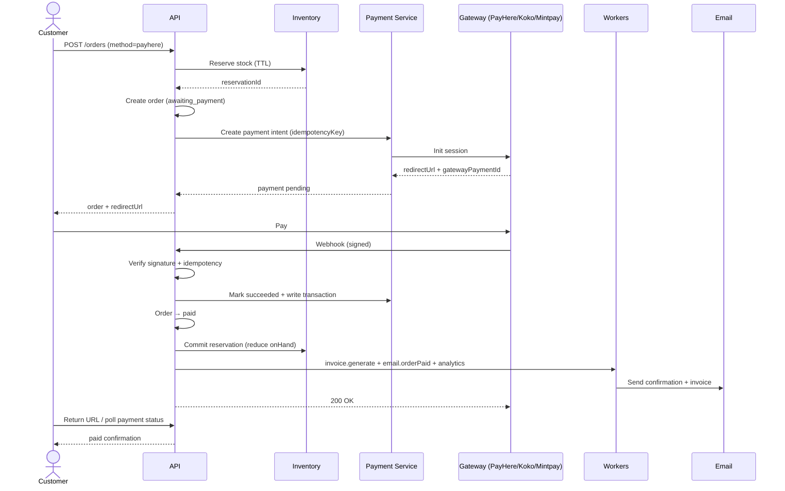
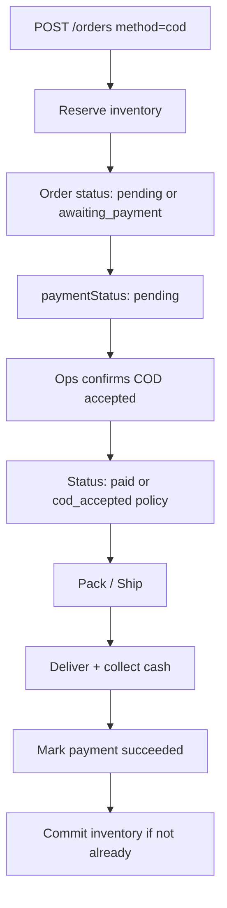

# 06 — Payment Flow

> Secure, idempotent payment architecture for **PayHere**, **Koko**, **Mintpay**, and **COD**.  
> Design only — no SDK wiring in this phase.

---

## 1. Goals

- Never trust client-reported “paid” status
- Inventory safety: reserve early, commit on success, release on failure/expiry
- Idempotent webhooks and payment intents
- Clear audit trail via `payments` + `transactions`
- PCI minimization: no card PAN/CVV stored on FE Platform servers

---

## 2. Supported Methods

| Method    | Type                | Customer UX                   | Capture model                                                         |
| --------- | ------------------- | ----------------------------- | --------------------------------------------------------------------- |
| `payhere` | Card/wallet gateway | Redirect / popup → return URL | Async webhook authoritative                                           |
| `koko`    | BNPL / gateway      | Redirect                      | Async webhook                                                         |
| `mintpay` | BNPL / gateway      | Redirect                      | Async webhook                                                         |
| `cod`     | Cash on delivery    | No redirect                   | Mark `awaiting_payment` / `cod_confirmed`; capture on delivery policy |

---

## 3. Happy Path (Online Gateways)

---

## 4. Step Detail

### Step 1 — Create Order

- Validate cart lines, prices (re-price server-side), coupon, address
- Reject if any variant unavailable

### Step 2 — Reserve Inventory

- For each line: increment `inventory.reserved`, write `stock_ledger` (`reserve`), create `inventory_reservations` with `expiresAt` (e.g. 30–60 min)
- Use optimistic `version` or transactional update

### Step 3 — Persist Order + Payment Intent

- `orders.status = awaiting_payment`
- `payments.status = pending`
- `idempotencyKey = hash(orderId + method + amount)`

### Step 4 — Redirect to Gateway

- Return `redirectUrl` to client
- Never reduce `onHand` yet

### Step 5 — Webhook Verification

For each gateway adapter:

1. Read raw body
2. Validate signature/HMAC per provider docs
3. Optional IP allowlist
4. Compute `payloadHash`; if transaction exists → return `200` (idempotent)
5. Validate `amount` + `currency` + `orderId` match pending payment
6. Persist `transactions` row with `signatureValid: true`

### Step 6 — Update Payment & Order

- `payments.status = succeeded`, `paidAt = now`
- `orders.paymentStatus = paid`, `orders.status = paid` (see order flow)
- Append `statusHistory`

### Step 7 — Generate Invoice

- Enqueue job → PDF to S3 → store URL on order/invoice metadata

### Step 8 — Reduce Inventory (Commit)

- `reserved -= qty`, `onHand -= qty`, `available` recompute
- Ledger `commit`
- Reservation → `committed`

### Step 9 — Notify

- Email/SMS/push: order confirmation
- Admin notification optional for high-value orders

### Step 10 — Complete Payment Phase

- Fulfillment continues as Packed → Shipped → Delivered (order flow)

---

## 5. COD Flow

**Policy choice (decide at implementation):**

- **A:** Commit stock when warehouse packs (risk if COD cancel)
- **B (recommended):** Keep reserved until delivery confirmed or ops marks collected; release on cancel

---

## 6. Return URL vs Webhook

| Channel            | Trust    | Use                                                   |
| ------------------ | -------- | ----------------------------------------------------- |
| Browser return URL | **Low**  | UX only — show “processing”, poll `GET /payments/:id` |
| Webhook            | **High** | Sole authority for `succeeded` / `failed`             |

If return arrives before webhook: show pending. If webhook never arrives: reconciliation job queries gateway API.

---

## 7. Failure Scenarios

| Scenario                                  | Detection                             | System action                                                                     |
| ----------------------------------------- | ------------------------------------- | --------------------------------------------------------------------------------- |
| Customer abandons gateway                 | Reservation TTL / gateway timeout     | Job releases stock; order `cancelled` or `payment_failed`                         |
| Webhook signature invalid                 | Adapter                               | `401/400`, audit log, no state change                                             |
| Amount mismatch                           | Compare intent vs webhook             | Quarantine payment `failed`; alert finance; do not fulfill                        |
| Duplicate webhook                         | `payloadHash` / `gatewayTxnId` unique | Return 200; no double commit                                                      |
| Pay success but commit stock fails        | Worker retry                          | Retry commit; alert; order stays paid (manual ops if exhausted)                   |
| Stock reserved but order crash mid-create | Outbox / compensating txn             | Orphan reservation cleaner                                                        |
| Refund requested                          | Finance `orders.refund`               | Gateway refund API → transaction `refund` → inventory restock policy              |
| Partial refund                            | Line-level                            | Adjust paymentStatus `partially_refunded`; restock shipped items via returns flow |
| Gateway downtime on init                  | Init error                            | Order stays `awaiting_payment`; allow retry intent                                |
| COD customer refuses delivery             | Shipment `failed` / return            | Release or restock; cancel/refund path N/A                                        |

---

## 8. Refund Flow (Online)

1. AuthZ: `orders.refund`
2. Validate order state allows refund
3. Create refund transaction intent (idempotent)
4. Call gateway refund
5. On success: update payment, order status `refunded` / `partially_refunded`
6. Restock via inventory `return` ledger (if items returned)
7. Email + audit log

---

## 9. Security Controls Specific to Payments

- Webhook routes excluded from JWT; dedicated rate limits
- Store gateway secrets in env/secret manager
- Redact PAN-like fields from `rawPayload`
- Idempotency-Key required on `POST /payments/intents`
- Finance role separation from warehouse

---

## 10. State Mapping (Payment ↔ Order)

| Payment status | Typical order paymentStatus | Typical order status       |
| -------------- | --------------------------- | -------------------------- |
| pending        | pending                     | awaiting_payment           |
| processing     | pending                     | awaiting_payment           |
| succeeded      | paid                        | paid                       |
| failed         | failed                      | payment_failed / cancelled |
| refunded       | refunded                    | refunded                   |
| cancelled      | failed                      | cancelled                  |

---

## Related

- [07-order-flow.md](./07-order-flow.md)
- [02-database-design.md](./02-database-design.md) — `payments`, `transactions`
- [08-security.md](./08-security.md)
