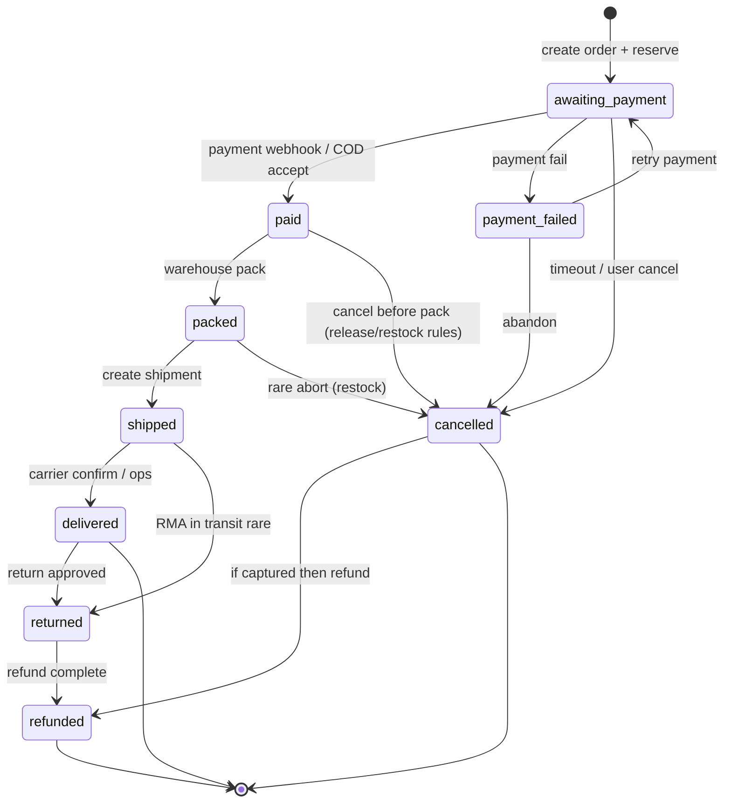

# 07 — Order Flow

> Complete order lifecycle, transitions, inventory coupling, and actor permissions.

---

## 1. Status Model

### Primary `orders.status`

| Status             | Meaning                                           |
| ------------------ | ------------------------------------------------- |
| `pending`          | Created draft / COD pre-confirm (optional)        |
| `awaiting_payment` | Stock reserved; waiting gateway or COD accept     |
| `payment_failed`   | Payment failed; stock release pending/done        |
| `paid`             | Funds confirmed (or COD accepted per policy)      |
| `packed`           | Items picked & packed                             |
| `shipped`          | Handed to carrier                                 |
| `delivered`        | Customer received                                 |
| `cancelled`        | Cancelled before fulfillment completion           |
| `returned`         | Return completed after delivery                   |
| `refunded`         | Money returned (may pair with cancelled/returned) |

### Secondary fields

| Field               | Values                                                                      |
| ------------------- | --------------------------------------------------------------------------- |
| `paymentStatus`     | `pending`, `authorized`, `paid`, `failed`, `refunded`, `partially_refunded` |
| `fulfillmentStatus` | `unfulfilled`, `partial`, `fulfilled`                                       |

---

## 2. State Machine



**Illegal transitions** must return `409` with code `INVALID_ORDER_TRANSITION`.

---

## 3. Transition Matrix

| From → To                             | Trigger              | Actor                                      | Inventory                    |
| ------------------------------------- | -------------------- | ------------------------------------------ | ---------------------------- |
| → `awaiting_payment`                  | `POST /orders`       | Customer/Guest                             | Reserve                      |
| `awaiting_payment` → `paid`           | Webhook / COD accept | System / Finance-Support                   | Commit                       |
| `awaiting_payment` → `payment_failed` | Webhook fail         | System                                     | Release                      |
| `awaiting_payment` → `cancelled`      | User/admin/TTL job   | Customer (`cancel_own`) / Support / System | Release                      |
| `payment_failed` → `awaiting_payment` | Retry intent         | Customer                                   | Re-reserve if released       |
| `paid` → `packed`                     | Admin status         | Warehouse / Manager                        | Already committed            |
| `packed` → `shipped`                  | Shipment created     | Warehouse                                  | —                            |
| `shipped` → `delivered`               | Tracking / manual    | Warehouse / System                         | —                            |
| `paid`/`packed` → `cancelled`         | Admin cancel         | `orders.cancel`                            | Restock (+ refund if needed) |
| `delivered` → `returned`              | RMA complete         | Support / Manager                          | Restock on receive           |
| `*` → `refunded`                      | Refund success       | Finance                                    | Per RMA policy               |

---

## 4. Lifecycle Narrative

### 4.1 Placement

1. Server re-validates prices & stock
2. Create order number (`FE-YYYY-######`)
3. Snapshot addresses & line items
4. Reserve inventory
5. Initiate payment (or COD)

### 4.2 Payment phase

See [06-payment-flow.md](./06-payment-flow.md).

### 4.3 Warehouse

1. Pick list from `order_items` + warehouse allocation
2. Mark `packed`; optional package weight/dims on shipment
3. Create `shipments` with tracking → `shipped`
4. Notify customer

### 4.4 Delivery

- Carrier webhook (future) or ops marks `delivered`
- COD: confirm cash collected → payment succeeded if deferred

### 4.5 Cancel

**Allowed typically when:** `awaiting_payment`, `payment_failed`, `paid` (before ship), sometimes `packed`.

**Not allowed when:** `shipped` (use return), `delivered`, `refunded`.

### 4.6 Return / Refund

1. Customer/support opens return request (future collection `returns`)
2. Receive goods → inventory `return`
3. Refund payment → `refunded` / `partially_refunded`

---

## 5. Status History

Every transition appends:

```json
{
  "status": "shipped",
  "at": "2026-07-01T12:00:00.000Z",
  "by": "665f…",
  "note": "Handed to courier XYZ"
}
```

Displayed in admin & customer order timeline.

---

## 6. Notifications by Status

| Status           | Customer               | Admin/Ops                 |
| ---------------- | ---------------------- | ------------------------- |
| awaiting_payment | Pay link if needed     | —                         |
| paid             | Confirmation + invoice | Optional high-value alert |
| packed           | Optional               | —                         |
| shipped          | Tracking email         | —                         |
| delivered        | Review ask             | —                         |
| cancelled        | Cancel notice          | —                         |
| refunded         | Refund notice          | Finance log               |

---

## 7. Concurrency Rules

- Order updates check `version`
- Status change uses compare-and-set on current status
- Payment webhook and admin cancel race: webhook wins if already `paid` mid-cancel → cancel becomes refund flow

---

## 8. Guest Orders

- `customerId` may be null initially
- Access via authenticated email magic link or order number + email verification
- On register, attach historical orders by verified email

---

## Related

- [06-payment-flow.md](./06-payment-flow.md)
- [05-rbac.md](./05-rbac.md)
- [04-api-design.md](./04-api-design.md)
